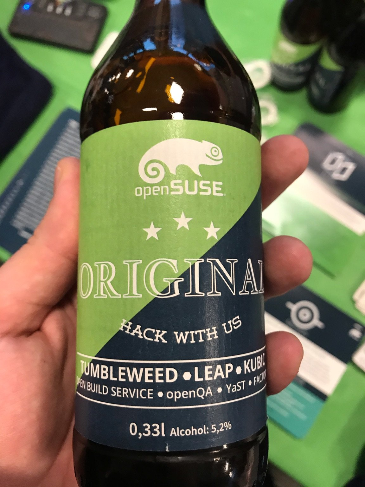
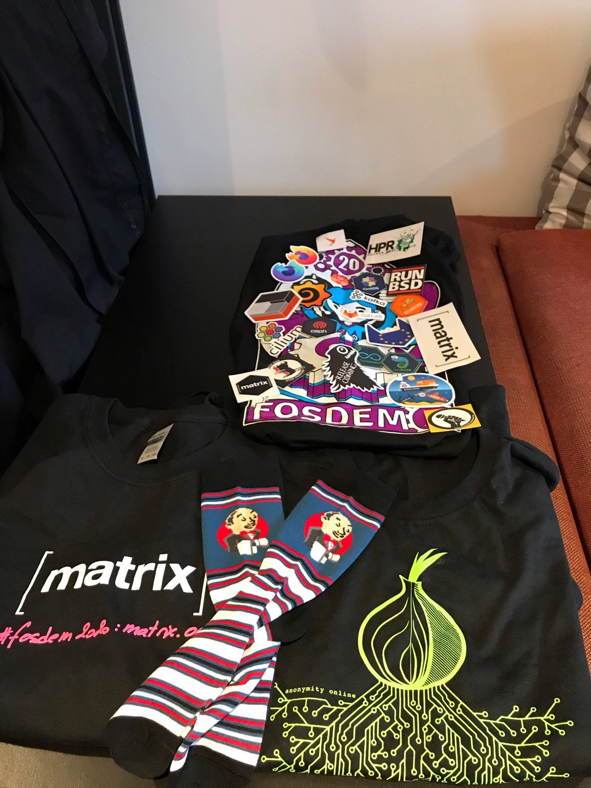

# FOSDEM 2020
[FOSDEM](https://fosdem.org/) is a Free and Open Source Software (FOSS) conference in Brussels. It is one of the biggest of its kind in Europe, with thousands of developers from all over the world gathering at the event. If you are into FOSS or you contribute to open source projects then this is the place to be. This year was an important year for [FOSDEM](https://fosdem.org/) as it was celebrating its 20th anniversary. To commemorate the occasion, a number of the talks were focused on the history and evolution of FOSS.

In this blog post I will walk you through the different talks I attended. Most of them were recorded and you can find them the full list of talks [here](https://fosdem.org/2020/schedule/).

### [The Linux Kernel: We have to finish this thing one day ;) solving big problems in small steps for more than two decades](https://fosdem.org/2020/schedule/event/linux_kernel/) by [Thorsten Leemhuis](https://fosdem.org/2020/schedule/speaker/thorsten_leemhuis/)
This talk was a great overview of where the Linux kernel started and how far it has come, all the while taking small steps to solve the big problems. Thorsten also covers some of the changes that have impacted the kernel such as the creation of eBPF, which is allowing container technology to be more efficient and secure. The talk also briefly covers the state of filesystems in the kernel.

### [Kata containers on openSUSE](https://fosdem.org/2020/schedule/event/containers_kata/) by [Ralf Haferkamp](https://fosdem.org/2020/schedule/speaker/ralf_haferkamp/)

[Kata](https://katacontainers.io/) is an interesting take on containers. It allows you to swap the [runc](https://github.com/opencontainers/runc) runtime with [Kata](https://katacontainers.io/). You can leverage small virtual machines for each of the containers you are deploying, giving even more isolation between them but still allowing you to take advantage of all the tools that are created for containers such as BPF, [Kubernetes](https://kubernetes.io/), [podman](https://podman.io/) and the [OCI image format](https://github.com/opencontainers/image-spec). It’s also available rootless.

Just before this talk I got to chat to Richard Brown, [OpenSuse](https://www.opensuse.org/) ex-Board Chairman, about [podman](https://podman.io/) and filesystems, all of this without realising who I was talking to. This is one of the things I love about [FOSDEM](https://fosdem.org) - you can just bump into and casually talk to so many amazing devs.

### [How containers and Kubernetes re-defined the GNU/Linux operating system a greybeard’s worst nightmare](https://fosdem.org/2020/schedule/event/riek_kubernetes/) by [Daniel Riek](https://twitter.com/RiekDaniel)

This was an interesting talk about the evolution of the computing stack covering the influence of the different technologies over time. It looked at how technologies like VMs, containers, binary packages and more, have drastically changed how we consume software and how we architect our solutions.

### [State of the Onion the road to mainstream adoption and improved censorship circumvention](https://fosdem.org/2020/schedule/event/tor/) by [Pili Guerra](https://fosdem.org/2020/schedule/speaker/pili_guerra/)

This session was the annual report on the state of the [Tor Project](https://www.torproject.org/). For those of you that don’t know what the [Tor Project](https://www.torproject.org/) is, it’s a distributed uncensored network which allows you to be anonymous while accessing the Internet.

This project is very important to me as I have seen its use to save lives and allow people to continue to fight their corrupt or dictatorial governments in a country where they are censored. The [Tor Project](https://www.torproject.org/) organisation continues to improve the user experience of the Tor Browser, and they have built a very talented UX team who are utilising the latest in industry techniques. One of these techniques being user [personas](https://www.usability.gov/how-to-and-tools/methods/personas.html). User [personas](https://www.usability.gov/how-to-and-tools/methods/personas.html) are used to help drive UX improvements across all the products the [Tor Project](https://www.torproject.org/) distributes. They made the [personas](https://www.usability.gov/how-to-and-tools/methods/personas.html) available freely, which got me and a friend discussing how it would be awesome to have a large repository of open source [personas](https://www.usability.gov/how-to-and-tools/methods/personas.html) for all FOSS projects to take advantage of. This would help improve the user experience of FOSS products, reaching more people out there and maybe finally bringing the year of Linux on the desktop.

They also had some cool stats for people who like to dig into the numbers. For example, the current available network bandwidth is around 300Gbps and only half of it is being used. This is thanks to the community of volunteers that run well over 6000 relays.

Sadly, the report also showed a drop in the number of bridges. Bridges are relays that are not publicly published that allow people to access the network even when it is blocked or censored in their environment.

Lastly, they covered the release of the Tor Browser on Android. Previously, accessing the Tor network on mobile required 2 applications - Orbot and Orfox and the new release removes the complexity of having 2 applications to access Tor.

### [Homebrew: features and funding](https://fosdem.org/2020/schedule/event/hfaf/) by [Mike McQuaid](https://mikemcquaid.com/about/)

This was an interesting session on how [Homebrew](https://brew.sh) manages beta access by putting users who have ran the dev tools onto the beta channel. The talk covered how [Homebrew](https://brew.sh) uses feature flags to allow testing of broken/not yet ready features. Mike shared how [Homebrew](https://brew.sh) achieved better reach for funding by asking for it in a polite and non-intrusive way within the tool itself, where users would actually see it.

### [Reinventing home directories let’s bring the UNIX concept of home directories into the 21st century](https://fosdem.org/2020/schedule/event/rhdlp/) by [Lennart Poettering](http://0pointer.de/lennart/)

This is one of the talks that I missed out on but I will be waiting impatiently for the release of the recording. [Systemd-homed](https://github.com/poettering/systemd/tree/homed) will be a space to keep an eye on as it will fundamentally change how home directories are managed and setup on [systemd](https://github.com/poettering/systemd) Linux distributions.

### [An introduction to the Tor ecosystem for developers](https://fosdem.org/2020/schedule/event/dip_tor_dev_intro/) by [Alexander Færøy](https://ahf.me/)

Another talk on the [Tor Project](https://www.torproject.org/), this time about how it is maintained and developed. It was a great introduction on where to start if you are interested in contributing to the project.

### [The path to Peer-to-Peer Matrix in which we throw away DNS and run Matrix clientside over libp2p and friends](https://fosdem.org/2020/schedule/event/dip_p2p_matrix/) by [Matthew Hodgson](https://fosdem.org/2020/schedule/speaker/matthew_hodgson/)

As a die-hard fan of [Matrix](https://matrix.org/) I was a bit sad to have to miss this talk, but the [recording is available here](https://ftp.belnet.be/mirror/FOSDEM/2020/UA2.220/dip_p2p_matrix.mp4). For those of you who haven’t heard of [Matrix](https://matrix.org/), it is an open standard for secure, decentralised, real-time communication. The easiest way to use it is via an app called [Riot](https://riot.im/) which I really like. This talk specifically detailed the instructions on how to make [Matrix](https://matrix.org/) peer to peer, removing the need for servers and DNS.

### [Privacy by design](https://fosdem.org/2020/schedule/event/privacy_by_design/) by [Trishul Goel](https://fosdem.org/2020/schedule/speaker/trishul_goel/)

I would recommend this session to all web devs out there - it covered how to build a website that protects user's data by design, utilising available HTTP headers such as [Content Security Policy](https://developer.mozilla.org/en-US/docs/Web/HTTP/CSP) and the new [Feature Policy](https://developer.mozilla.org/en-US/docs/Web/HTTP/Feature_Policy). All of this while creating a more performant website.

### [FOSSH - 2000 to 2020 and beyond! maddog continues to pontificate](https://fosdem.org/2020/schedule/event/fossh/) by [Jon ‘疯狗’ Hall](https://twitter.com/maddoghall)

This was the highlight of the conference for me. Delivered by Jon “Maddog” Hall, it was a great historical overview of the evolution of Freedom and Open Source Software, full of comedy and even got a bit emotional. I cannot recommend it enough especially if you love FOSS as much as I do.

### Conclusion

[FOSDEM](https://fosdem.org/2020/) was an excellent event and I would recommend it highly to anyone who is passionate about or would like to explore the world of FOSS. For me, it was also a great excuse to spend some time in Brussels - the city where I grew up.

### A few pictures from the conference:
Using vim to keep track of the busy timetable of the event.

The hackers drink of choice and so full of caffeine.

openSUSE brought German beer to Belgium.

Some of my new favourite stickers in there.

So much great swag, my favourite being the [Tor Project](https://www.torproject.org/)

###### Last updated 2025-06-02