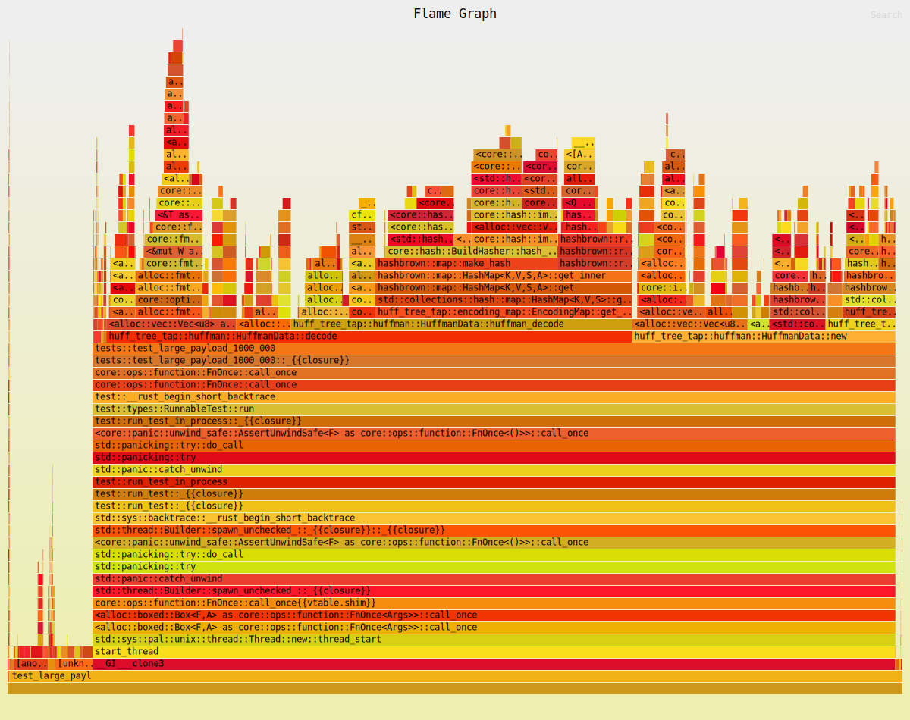

# Rust, learnings and journey

## Rewriting My Skills: A Personal Journey Toward Better Engineering

In September 2021, I changed my career, I went from the world of Cyber Security to Software Engineering and System Design. Not long after, I was promoted to a Principal Engineer role which I felt ready for due to my extensive background in designing, building and deploying complex, resilient systems and my ability to take the lead in these types of projects. 

I quickly learned that my software skills were really quite superficial. I had spent most of my career up to that point learning to find vulnerabilities in other people's code and the ins and outs of memory buffers but I never had to write quality code myself. 

In my new role, this started to bother me quite a bit, I couldn't always explain why the code was not right even though my instinct said there was something wrong, and for the first time in a long time, senior engineers on my teams would confuse me. It was a new challenge and I was really up for it.

## The start

In order to reduce the gap in my knowledge, I incorporated coding into my life as a hobby. I first started looking into the languages the company I work for uses, C# and TypeScript, however at the time I was reading a lot about Rust and also listening to [On The Metal](https://onthemetal.transistor.fm/) podcast which lead me to decide to learn Rust instead. My reasons behind the change were that I was doing this for myself and not the company (though the end result has been beneficial in that respect as well), and I had also read a blog post claiming that Rust holds your hand and helps you avoid simple mistakes. This, as it turns out, was both accurate and misleading.

I had written code in Rust before but in order to learn more I started by implementing Huffman Encoding in Rust. 

## Huff-Tree-Tap v0.0.x

In my first attempt to implement Huffman Encoding, I made quite a few mistakes and 100% misunderstood the borrow checker.

### The mistakes

My first major mistake was that I didn't embrace the `Result` and `Option` types and ended up with a load of `unwrap()`s. Rust's error handling system is something that I have now learned to love but back then it was confusing and frustrating to call a function and not get the value.

My second mistake was that I fought with the borrow checker rather than let it tell me what was going on. So I ended up with a lot of unnecessary `clone()`s  and a lot of  `mut` references when they weren't required by my functions. I made the mistake of having some functions that did far too much because I had gotten tired of the moved-out-of-scope errors.

### The good

Rust's testing framework simplicity meant that I wrote a lot of tests (at the time I was also learning about test driven development for work).

Rust's documentation also helped a lot. The second I learned that I could generate [docs.rs](http://docs.rs) from my own code and have it include the docs for my dependencies my inner documentation nerd took the wheel and went off to the races.

Another thing I did was make sure I knew how to package my library, which lead me to learn how [crates.io](https://crates.io/crates/huff-tree-tap) and cargo work but also how build a CI/CD pipeline for Rust. These ended up being very straight forward.

In conclusion, I managed to create a working Huffman Encoding library which was working and well tested. If you are curious you can find the last `v0.0.x` of the code [here](https://github.com/chimbosonic/huff-tree-tap/tree/v0.0.5)

## Learning More

After implementing Huffman encoding, I felt like I was ready to take on something new. This time around I needed a project that was actively used and had more eyes on it as I wanted feedback on what I was working on. 

One of the technologies that fascinates me the most  is OpenPGP, especially the identity side of things (the subject of my final year project in university was on Enforcement of Access Control in P2P Networks Utilising OpenPGP). The coolest project in this space in my opinion is [Keyoxide](https://keyoxide.org/). At the time I was looking for a public project to work on the core maintainer of  Keyoxide's was rewriting core functionality in Rust. 

I took the opportunity to brush the dust of my bound copy of [RFC 4880](https://www.rfc-editor.org/rfc/rfc4880) and read the documentation on [Sequoia](https://sequoia-pgp.org/) (an implementation of OpenPGP in Rust), going on to help implement the Keyoxide core in Rust.

Here I learned a lot more about the methods of writing code specific to Rust, things like `map`, `iter` , `match`  and more importantly Rust's error handling. I also started using `cargo watch -x fmt -x check -x clippy -x test` to make sure what I was writing was following linting rules. Working on this also gave me the opportunity to work with other engineers in Open Source codebases - something I had once only dreamed of.

At this point, I was more confident with software engineering and I was able to bring more to discussions about coding at work. 

## Huff-Tree-Tap v0.1.x - 3 years later

After 3 years of constantly looking for ways to improve my software engineering skills, I decided to revisit my original Rust project. This time around, I was looking to refactor the code to follow the new practices I had learned but I also changed my mindset from looking at it as a hobby project to treating it as if it was critical software.

### Linting and adding benchmarking

My first set of refactors involved using `clippy` and implementing a new benchmark test using the`criterion` framework. Benchmarking helped me measure my progress and track if the refactoring I as doing actually improved performance.

The benchmark I was running was encoding and decoding an array of 64 000 bytes and at the beginning, the results were as follows:

```bash
Huffman/huffman_encode  time:   [1.0851 ms 1.1029 ms 1.1223 ms]
Huffman/huffman_decode  time:   [1.1085 ms 1.1384 ms 1.1726 ms]
```

Most of the linting involved cleaning up the unnecessary `clone()` and `mut` from the code but also removing the `unwrap()` calls and implementing better error handling.

### Clean code and breaking down functions

Next I focused on breaking out each part of the system and creating `struct`s that represented the different data structures I was using. I implemented `traits` to provide functions on those data structures. This helped split up the different parts of logic, allowed me to reduce how much each of my functions was doing and gave me a clear and concise view. As I was treating every change as if it was applied on citical software, I had to make sure every one of my commits contained tests, including checking the external APIs hadn't changed, and had successfully passed those tests. Rust's type system and testing framework really shined here and made doing these refactors a breeze.

Once I broke everything out into its independent moving parts I restructured the repo so each part had its own file rather than being a very long `lib.rs`.

### Benchmarking post the refactor

Benchmarking the refactor was as easy as running `cargo bench` again and the results were:

```bash
Huffman/huffman_encode  time:   [627.06 µs 643.82 µs 662.17 µs]
                        change: [-45.908% -43.891% -42.096%] (p = 0.00 < 0.05)
Huffman/huffman_decode  time:   [1.1085 ms 1.1384 ms 1.1726 ms]
                        change: [-30.631% -28.453% -26.042%] (p = 0.00 < 0.05)
```

As this shows, I managed to achieve a pretty major improvement without changing the behaviour too much, just moving code around and using the borrow checker correctly. If you want to check it out click [here](https://github.com/chimbosonic/huff-tree-tap/tree/v0.1.0)

## Huff-Tree-Tap v0.2.x - Chasing the optimisations

At this point I was happy with how the code looked but I really wanted to continue improving the performance. 

To find the slowest parts of my code, I used `cargo flamegraph` to profile my repo. It uses Linux's `perf` under the hood to generate these detailed flame-graphs that help visualise the runtime of functions.



This led me to realise that manipulating strings is very slow. When I originally wrote this library, I used `String` to store the bit format encoding as I had found that you could format a `u8`  into its binary representation by just calling `format!("{:b}", x)` . 

To optimise this I created a type to represent bits called `Bit` which was `u8`s consisting of 0s and 1s. To store a `u8`as a set of `Bit`s, I  created a `Vec<Bit>`.  I then wrote traits for the conversion of `u8` to a `Bit`,  `Vec<u8>` to `Vec<Bit>` and vice-versa. With `u8` being the smallest byte addressable unit in Rust, this meant my functions were using less memory but also were making no calls to any of the functions from `String`.

The flame-graphs continued to be super useful in identifying the longest function calls and the hot paths to focus on to improve the performance.

The benchmark results after these improvements looked like this:

```bash
Huffman/huffman_encode  time:   [406.26 µs 414.72 µs 423.78 µs]
                        change: [-39.115% -37.313% -35.510%] (p = 0.00 < 0.05)
Huffman/huffman_decode  time:   [392.79 µs 397.60 µs 404.15 µs]
                        change: [-62.323% -61.680% -61.009%] (p = 0.00 < 0.05)
```

From the start of this project, I had managed to improve the performance of both encode and decode by 125%.

## Learnings

In the end, what really mattered was that I became comfortable with getting my hands dirty and digging deeper into the craft of writing good software. I went from knowing how to spot issues in code to actually understanding why they happen and how to fix them. Along the way, I learned to trust the language's constraints, embrace benchmarks to guide meaningful improvements and the importance of testing and documentation. This isn't just about coding better - it's about seeing problems clearly, breaking them down, and treating even a personal side project with the care and attention I'd give to a production-level system.

Ultimately, the skills, confidence, and mindset I built during this journey have made me a stronger Principal Engineer. Now, when I look at a piece of code, I'm not just relying on my instincts, I can actually explain why something should be done a certain way to others.

And the journey doesn't end here; I'm still learning, still experimenting, and still finding new ways to become a better engineer every day.

###### Last updated 2025-01-07
